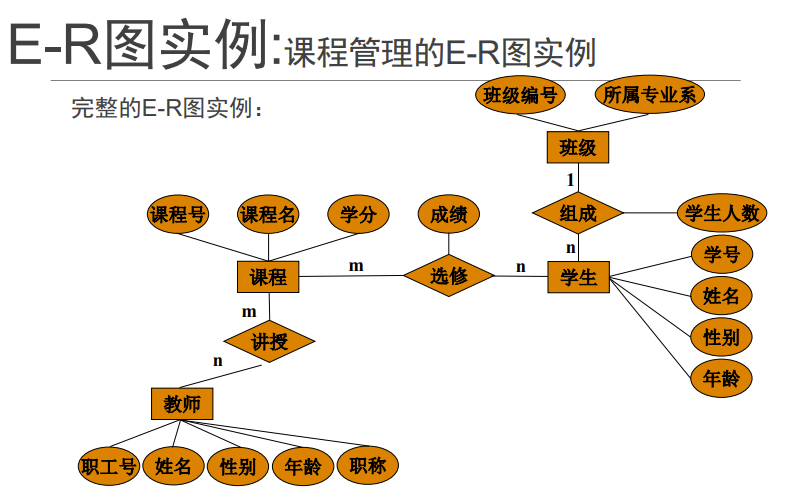

# 第一章: 数据库概念

### 一. 基本定义

**1. 数据库(DB):** 数据库(Database,简称DB)是长期储存计算机内、有组织的、可共享的数据集合

**2. 数据库管理系统(DBMS):** DBMS使用户能方便地定于数据和操纵数据，并能够保证数据的安全性、完整性、多用户对数据的并发使用及发生故障后的系统恢复

**3. 数据库系统(DBS):** 是指在计算机系统中引入数据库后的系统构成

**区别与联系:** 
- DBS包含DB和DBMS, DBS的核心是DBMS
- 对于程序员, DBMS提供了很大的便利, 可以更加专注程序本身
- DBS与普通软件系统的最大区别在于: 普通软件自己管理数据及数据安全, DBS由DBMS帮我们管理

---

### 二. 联系

**一对一联系:** 对于实体集A中的每一个实体，实体集B中至多有一个实体与之联系，反之亦然

**一对多联系:** 对于实体集A中的每一个实体，实体集B中有n个实体（n≥0）与之联系,反之至多有1个实体联系,记为1:n

**多对多联系:** 对于实体集A中的每一个实体，实体集B中有n个实体（n≥0）与之联系,反之有m个实体（m≥0）联系,记为m:n

---

### 三. 概念模型表示(E-R图)

**概念模型:** 客观对象的抽象
1. 实体(Entity): 客观存在并可相互区别的事物
2. 属性(Attribute): 实体所具有的某一特性称为属性
3. 码(Key): 唯一标识实体的属性集称为码
4. 域(Domain): 属性的取值范围称为该属性的域
5. 实体型(Entity Type): 用实体名及其属性名集合来抽象和刻画同类实体称为实体型
6. 实体集(Entity Set): 同型实体的集合称为实体集
7. 联系(Relationship): 实体内部的联系和实体之间的联系

**实体－联系方法(E-R方法):** 
- 实体: 用矩形表示，矩形框内写明实体名
- 属性: 用椭圆形表示，并用无向边将其与相应的实体(或联系)连接
- 联系: 用菱形表示，菱形框内写明联系名，并用无向边分别与有关实体连接起来，并标上联系的类型（1:1、1:n或m:n）

E-R图示例:

 

<figcaption>E-R</figcaption>

