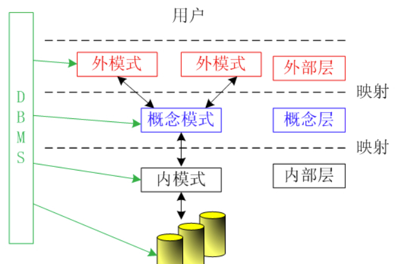

# 第四章: 数据库安全

**安全性**
1. 授权: GRANT <权限> ON <对象> TO <用户> [WITH GRANT OPTION];
2. 收回权限
3. 基于视图(视图特点):
    - 简化操作: 把经常使用的数据定义为视图
    - 安全性: 用户只能查询和修改能看到的数据
    - 独立性: 屏蔽了真实表的结构带来的影响

**二级独立性**
1. **物理独立性**: 
    - 定义: 是指用户的应用程序与存储在磁盘上的数据库中的数据是相互独立的
    - 作用: 当数据的物理存储改变时, 应用程序不需要改变
    - 位置: 存在于概念模式和内模式之间的映射转换, 反映物理组织发生变化时应用程序的独立程度
2. **逻辑独立性**: 
    - 定义: 是指用户的应用程序与数据库中的逻辑结构是相互独立的
    - 作用: 当数据的逻辑结构改变时，应用程序不需要改变。
    - 位置: 存在于外模式和概念模式之间的映射转换，反映概念模式发生变化时应用程序的独立程度

**三级模式**
1. **外模式(子模式, 用户模式)**: 用户能够看见和使用的局部数据的逻辑结构和特征的描述
2. **模式(概念模式, 逻辑模式)**: 逻辑结构和特征的描述
3. **内模式(存储模式)**: 数据物理结构和存储方式的描述

模式关系图:

 

<figcaption>E-R</figcaption>

**并发控制**
- 数据库是一个共享资源，可供多个用户使用。这些用户程序可以串行执行
- 应允许多个用户并行存储数据